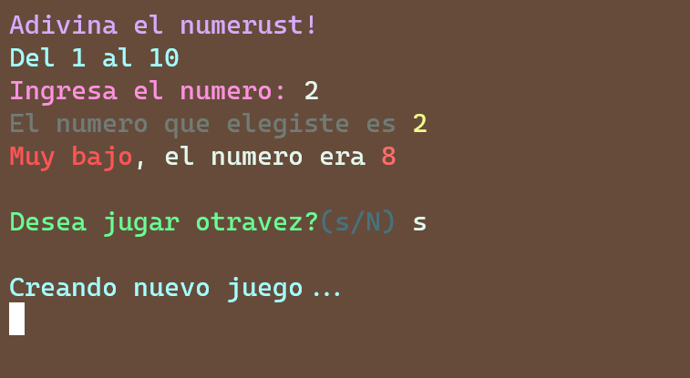
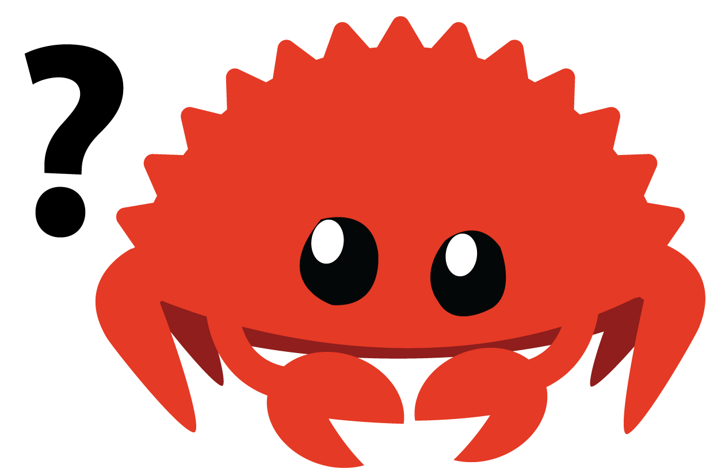

# Apuntes de Rust - Guessing game 


 


## Compile and run game

```
cargo run
```

Una vez compilado, si quiere limpiar la terminal antes de jugar, ejecute el juego con la flag -c o --clear 

```
./target/debug/guessing-game -c # --clear
```

Puede jugar de manera infinita pasando la flag -i o --infinity

```
./target/debug/guessing-game -i # --infinity

```

## Run specific script

```sh
sh run.sh src/file.rs
```

Este es un juego de consola hecho en rust, trata de adivinar el numero!

> Las notas sobre el lenguaje de Rust se encuentran en la wiki!

[Wiki](https://github.com/Tylung/rust-apuntes/wiki) 🦀

Cualquier duda o aporte a la documentación, código, etc. Pueden realizar un pull request, para agregarlo al repositorio :smiley: 
